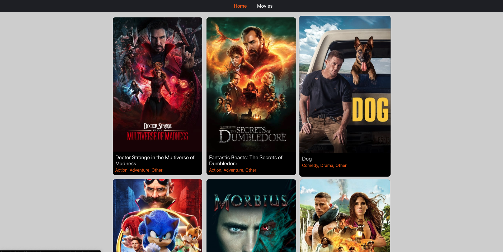
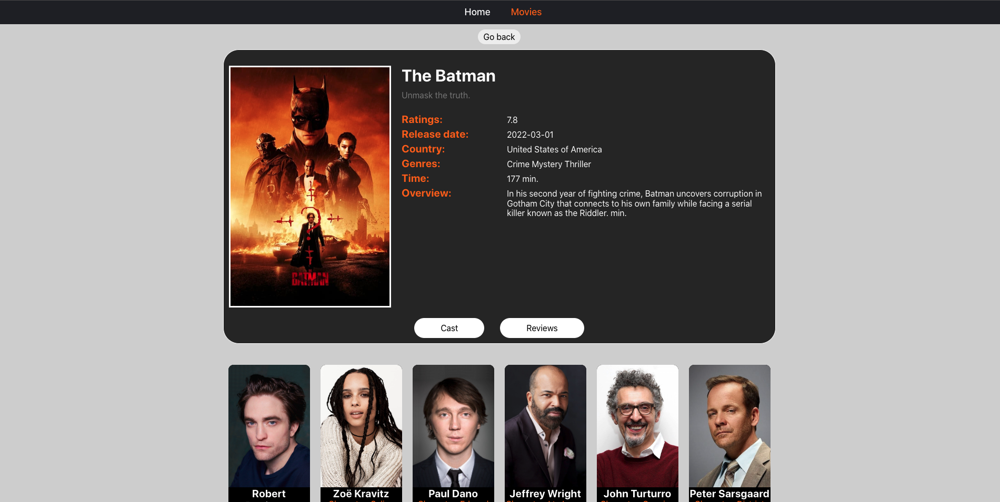
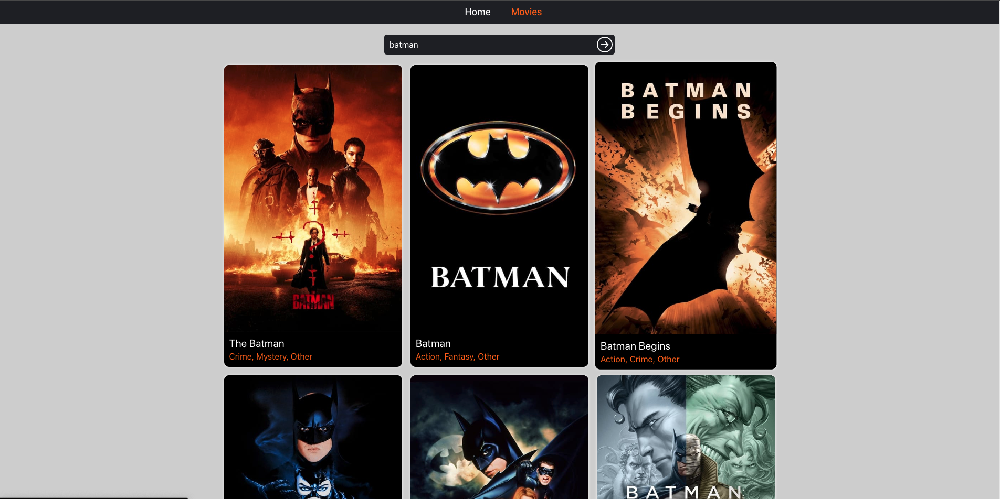

## «Кинопоиск»

Создана базовая маршрутизация для приложения поиска и хранения фильмов.

Превью рабочего приложения:

1) 2) 3)

## API themoviedb.org

Для бекенда используется [themoviedb.org API](https://www.themoviedb.org/).

- [/trending/get-trending](https://developers.themoviedb.org/3/trending/get-trending)
  список самых популярных фильмов на сегодня для создания коллекции на главной
  странице.
- [/search/search-movies](https://developers.themoviedb.org/3/search/search-movies)
  поиск кинофильма по ключевому слову на странице фильмов.
- [/movies/get-movie-details](https://developers.themoviedb.org/3/movies/get-movie-details)
  запрос полной информации о фильме для страницы кинофильма.
- [/movies/get-movie-credits](https://developers.themoviedb.org/3/movies/get-movie-credits)
  запрос информации о актёрском составе для страницы кинофильма.
- [/movies/get-movie-reviews](https://developers.themoviedb.org/3/movies/get-movie-reviews)
  запрос обзоров для страницы кинофильма.

Добавил асинхронную загрузку JS-кода для маршрутов приложения используя

`React.lazy()` и `Suspense`.
